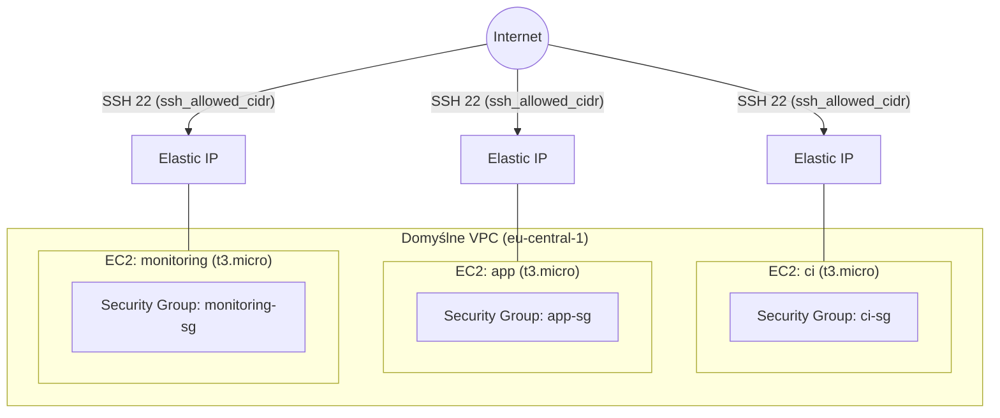

# Architektura sieci

Infrastruktura opiera się o domyślne VPC konta AWS (region `eu-central-1`), z trzema
instancjami EC2 tworzonymi przez jeden reużywalny moduł Terraform (`modules/ec2-instance`),
wywołany trzykrotnie z różną rolą.

## Diagram

## Rozmiar dysku (EBS)

Domyślne AMI Ubuntu 24.04 startuje z root volume 8 GB. Instancja `app` (Docker +
PostgreSQL w Docker Compose) ma to zwiększone do **12 GB** przez zmienną modułu
`root_volume_size` (nadpisaną w `terraform/main.tf` tylko dla `app`) — Postgres
i obrazy Dockera szybko wyczerpałyby domyślne 8 GB. `ci` i `monitoring` zostają
przy domyślnych 8 GB. Łącznie 8+8+12 = 28 GB, w granicach limitu AWS Free Tier
(30 GB-miesiąc EBS na całe konto).

Migracja bazy na zarządzaną usługę (RDS) rozwiązałaby problem miejsca elegancko,
ale to zmiana architektury wykraczająca poza założenia z DevOpsProj.md (Postgres
ma działać w Docker Compose na VM2) i nieproporcjonalny nakład pracy względem
zakresu tego etapu — świadomie odrzucone na rzecz zwiększenia root volume.

## Stan na Etap 1

- Każda instancja ma własny Elastic IP — adres stały, niezależny od `terraform destroy`/`apply`
  konkretnej instancji (patrz `modules/ec2-instance/main.tf`, zasób `aws_eip`).
- Każda instancja ma własny security group (`<rola>-sg`), obecnie otwierający **wyłącznie port 22
  (SSH)** ze źródła zdefiniowanego w zmiennej `ssh_allowed_cidr` (domyślnie `0.0.0.0/0`,
  do zawężenia w `terraform.tfvars`).
- Ruch wychodzący (`egress`) jest w pełni otwarty na wszystkich trzech instancjach.
- Brak w tym momencie komunikacji między instancjami zdefiniowanej na poziomie security group
  (np. `ci` → `app` po SSH do celów deployu) — to zostanie dodane w Etapie 6 (CD), gdy Jenkins
  będzie faktycznie potrzebował łączyć się z VM2.
  **Ważne:** to nie jest ograniczenie sieci VPC (routing działa między wszystkimi instancjami
  w tym samym VPC), tylko brak reguł `ingress` w security group. Gdy zajdzie potrzeba (Etap 6/7),
  reguła powinna wskazywać jako źródło **ID security group** drugiej instancji
  (`source_security_group_id`), a nie szeroki CIDR — dostęp dostanie wtedy tylko konkretna rola,
  nie cały VPC.

## Planowane rozszerzenia (kolejne etapy)

Moduł `ec2-instance` przyjmuje zmienną `extra_ingress_ports` (lista dodatkowych portów TCP)
właśnie po to, żeby dodanie portów per rola nie wymagało zmian w kodzie modułu — tylko w
wywołaniu w `terraform/main.tf`. Konkretne porty zostaną dopisane wraz z odpowiednim etapem:

| Rola | Etap | Planowany dodatkowy port |
|---|---|---|
| `ci` | Etap 4 (Jenkins) | port UI Jenkinsa (do ustalenia przy konfiguracji kontenera) |
| `app` | Etap 3 (aplikacja) | port backendu FastAPI (do ustalenia przy docker-compose) |
| `monitoring` | Etap 7 (Prometheus + Grafana) | porty Prometheusa i Grafany (do ustalenia przy docker-compose) |

Druga warstwa firewalla (`ufw` na poziomie systemu, rola Ansible z Etapu 2) jest opisana
osobno w dokumentacji Ansible — tu opisana jest wyłącznie warstwa AWS (security groups).
