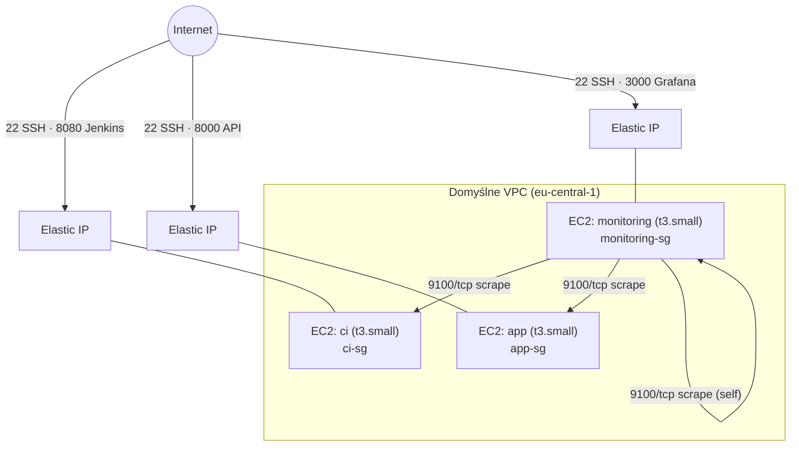

# Architektura sieci

Infrastruktura działa w domyślnym VPC konta AWS (region `eu-central-1`), z
trzema instancjami EC2 (`t3.small`) tworzonymi jednym reużywalnym modułem
Terraform (`modules/ec2-instance`), wywołanym trzykrotnie z różną rolą.
Każda instancja ma własny Elastic IP i własny security group. Ruch
przychodzący filtrowany jest dwuwarstwowo: security group AWS (ta strona)
i `ufw` na poziomie systemu (`deny incoming` / `allow outgoing` + jawne
wyjątki pokrywające się z regułami SG poniżej).

## Diagram

## Porty per instancja

| VM | Publiczne (Internet, `extra_ingress_ports`) | Wewnętrzne (tylko CIDR VPC, `internal_ingress_ports`) |
|---|---|---|
| `ci` | 22 (SSH), 8080 (UI Jenkinsa) | 9100 (node_exporter) |
| `app` | 22 (SSH), 8000 (API FastAPI) | 9100 (node_exporter) |
| `monitoring` | 22 (SSH), 3000 (Grafana) | 9100 (node_exporter), 9090 (Prometheus UI) |

Dwie osobne pule portów w module (`extra_ingress_ports` vs
`internal_ingress_ports`) rozdzielają to, co musi być dostępne z całego
internetu, od tego, co nie ma własnego uwierzytelniania (node_exporter,
Prometheus UI) i ma być widoczne wyłącznie z wnętrza VPC —
`internal_ingress_ports` używa CIDR domyślnego VPC (`data "aws_vpc"
"default"`), nie `ssh_allowed_cidr`. Ruch wewnętrzny (Prometheus →
node_exporter) musi iść po **prywatnym** IP instancji (`private_ip`) —
ruch między dwiema EC2 idący po publicznym Elastic IP nie jest dopasowywany
przez regułę SG ograniczoną do CIDR VPC.

## Rozmiar dysku (EBS)

Root volume parametryzowany per instancja (`ci_root_volume_size`,
`app_root_volume_size` w `terraform.tfvars`) — domyślne 8 GB AMI Ubuntu
24.04 jest za małe pod Docker + build cache (`ci`) oraz Docker + PostgreSQL
(`app`) pod pełnym obciążeniem.
